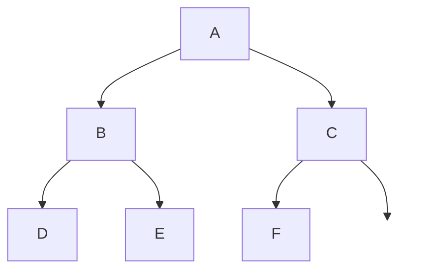
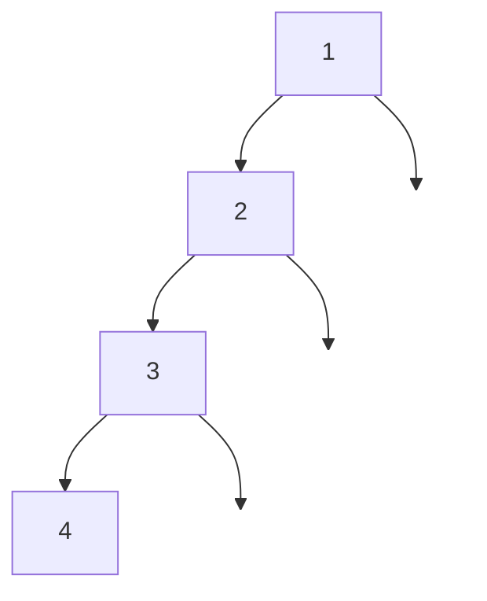
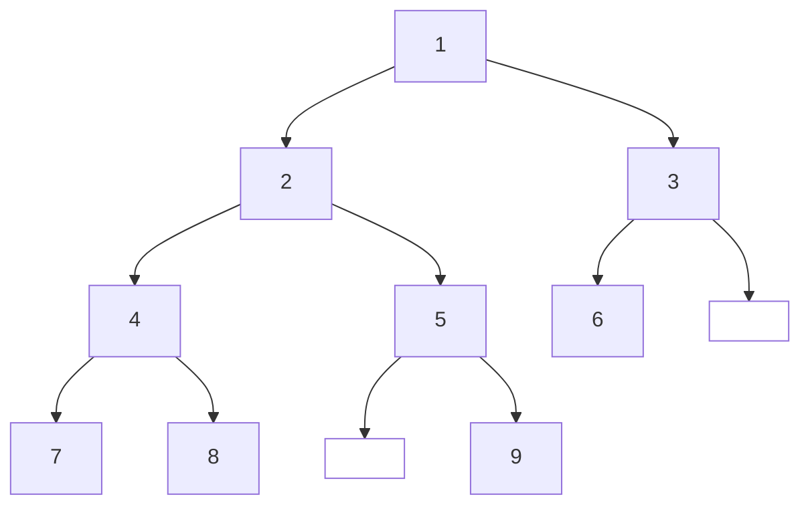

# 二叉树的遍历

> 作者为蒟蒻高中牲，若有不妥之处请多多包含，并望于评论区指正，不胜感激！

## 什么是二叉树

二叉树是一个**为空**或者**由不相交的左子树、右子树和根节点**组成的集合。其中左右子树也为二叉树。

例如，这是一个二叉树：



而这也是一个二叉树（已经退化成一条链了）：



左右子树为空集节点叫做叶子节点。

每一层被填满的二叉树叫做**完美二叉树（满二叉树）**。按照从上到下、从左到右的顺序编号，只有最后一层缺失、且缺失的编号都在最后在的二叉树叫做**完全二叉树**。

### 如何存储

#### (1 动态存储

数据结构中一般这样定义二叉树：

```cpp
struct Node {
	int value; // 节点的值，可以不止一个
    node *lson, *rson; // 指向左右子节点
}
```

动态新建一个`Node`时，使用`new`运算符动态申请一个。使用完毕记得使用`delete`命令释放防止内存泄漏。

动态二叉树的优点是不浪费空间，缺点是需要管理，容易出错。

#### (2 使用静态数组存储

比赛中一般使用这种方法，编码比较简单。

```cpp
struct Node {
    int value;
    int lson, rson; // 子节点在数组中的编号
} tree[N];
```

**特别地，可以使用单独的一个静态数组实现完全二叉树的存储**。

## 二叉树的各种遍历

常见遍历二叉树的方式有一下几种，我以以下树展示



### 先序遍历

按照`根节点 -> 左子树 -> 右子树`的顺序遍历。这颗树的先序遍历是`1 2 4 7 8 5 9 3 6`

```cpp
void preorder(Node root) {
    cout << root.value << ' ';
    if (root.lson)
	    preorder(tree[root.lson]);
    if (root.rson)
	    preorder(tree[root.rson]);
}
```

### 中序遍历

按照`左子树 -> 根节点 -> 右子树`的顺序遍历。这颗树的中序遍历是`7 4 8 2 5 9 1 6 3`

```cpp
void inorder(Node root) {
    if (root.lson)
	    inorder(tree[root.lson]);
    cout << root.value << ' ';
    if (root.rson)
	    inorder(tree[root.rson]);
}
```

### 后序遍历

按照`左子树 -> 右子树 -> 根节点`的顺序遍历。这颗树的后序遍历是`7 8 4 9 5 2 6 3 1`

```cpp
void postorder(Node root) {
    if (root.lson)
	    postorder(tree[root.lson]);
    if (root.rson)
	    postorder(tree[root.rson]);
    cout << root.value << ' ';
}
```

### 层序遍历

顾名思义，层序遍历即从上到下一层一层地遍历节点。

前面集中遍历方式都使用的DFS（深度优先搜索），层序遍历建议使用**BFS**（广度优先搜索）。

这颗树的层序遍历是`1 2 3 4 5 6 7 8 9`

```cpp
void bfs(Node root) {
    queue<Node> Q;
    Q.push(root);

    while (!Q.empty()) {
        Node node = Q.front();
        Q.pop();
        cout << node.value << ' ';

        if (node.lson)
            Q.push(tree[node.lson]);
        if (node.rson)
            Q.push(tree[node.rson]);
    }
}
```

总结一下，可以是这样的：

```cpp
#include "bits/stdc++.h"
using namespace std;

const int N = 100010; // 数组大小，根据需求调整

struct Node {
    int value;    // 节点值
    int lson;     // 左子节点索引，0表示空
    int rson;     // 右子节点索引，0表示空
} tree[N];

int idx = 1; // 当前可用的节点索引，从1开始（0表示空节点）
unordered_map<int, int> val_to_idx; // 值到索引的映射
int n;


// 创建新节点（如果已存在则返回现有索引）
int create(int value) {
    if (val_to_idx.count(value)) {
        return val_to_idx[value];
    }
    tree[idx] = {value, 0, 0};
    val_to_idx[value] = idx;
    return idx++;
}

// 构建二叉树
void build(int n) {
    for (int i = 0; i < n; i++) {
        int root_val, l_val, r_val;
        cin >> root_val >> l_val >> r_val;

        int root_idx = create(root_val);

        if (l_val != 0) {
            int l_idx = create(l_val);
            tree[root_idx].lson = l_idx;
        }

        if (r_val != 0) {
            int r_idx = create(r_val);
            tree[root_idx].rson = r_idx;
        }
    }
}

void preorder(Node root) {
    cout << root.value << ' ';

    if (root.lson)
        preorder(tree[root.lson]);
    if (root.rson)
        preorder(tree[root.rson]);
}

void inorder(Node root) {
    if (root.lson)
        inorder(tree[root.lson]);

    cout << root.value << ' ';

    if (root.rson)
        inorder(tree[root.rson]);
}

void postorder(Node root) {
    if (root.lson)
        postorder(tree[root.lson]);
    if (root.rson)
        postorder(tree[root.rson]);

    cout << root.value << ' ';
}

void bfs(Node root) {
    queue<Node> Q;
    Q.push(root);

    while (!Q.empty()) {
        Node node = Q.front();
        Q.pop();
        cout << node.value << ' ';

        if (node.lson)
            Q.push(tree[node.lson]);
        if (node.rson)
            Q.push(tree[node.rson]);
    }
}

// 查找根节点（没有父节点的节点）
int find_root() {
    // 标记所有出现的节点
    vector<bool> has_parent(idx + 1, false);

    for (int i = 1; i < idx; i++) { // 对于节点i，它的子节点一定有父节点
        if (tree[i].lson != 0) {
            has_parent[tree[i].lson] = true;
        }
        if (tree[i].rson != 0) {
            has_parent[tree[i].rson] = true;
        }
    }

    // 找到没有父节点的节点（根节点）
    for (int i = 1; i < idx; i++) {
        if (!has_parent[i]) {
            return i;
        }
    }
    return 1; // 默认返回第一个节点
}

int main() {
    cin >> n;

    build(n);

    int root = find_root();

    cout << "先序遍历:" << endl;
    preorder(tree[root]);
    cout << '\n';
    cout << "中序遍历:" << endl;
    inorder(tree[root]);
    cout << '\n';
    cout << "后序遍历:" << endl;
    postorder(tree[root]);
    cout << '\n';
    cout << "层序遍历:" << endl;
    bfs(tree[root]);

    return 0;
}
```

> 输入格式：
>
> 第1行一个数`n`代表节点个数
>
> 第2至n+1行三个数root, l, r，代表根节点、左右子节点的值
>
> 输入：
>
> ```plaintext
> 9
> 1 2 3
> 2 4 5
> 3 6 0
> 4 7 8
> 5 0 9
> 6 0 0
> 7 0 0
> 8 0 0
> 9 0 0
> ```
>
> 输出：
>
> ```plaintext
> 先序遍历:
> 1 2 4 7 8 5 9 3 6
> 中序遍历:
> 7 4 8 2 5 9 1 6 3
> 后序遍历:
> 7 8 4 9 5 2 6 3 1
> 层序遍历:
> 1 2 3 4 5 6 7 8 9
> ```

> 改进建议：
>
> 这里传递的参数都是`Node`类型的，导致调用一次就复制一遍`Node`，效率不如`int`高。请尝试修改代码，传递索引为参数。

---

### 如何根据先序遍历、中序遍历求后序遍历，或根据后序遍历、中序遍历求先序遍历？

#### 核心思想：

所有方法都基于二叉树遍历的一个**核心性质**：

1. **先序遍历 (Preorder)**：`[根节点]` + `[左子树的先序遍历]` + `[右子树的先序遍历]`
2. **中序遍历 (Inorder)**：`[左子树的中序遍历]` + `[根节点]` + `[右子树的中序遍历]`
3. **后序遍历 (Postorder)**：`[左子树的后序遍历]` + `[右子树的后序遍历]` + `[根节点]`

解决问题的关键是：**利用“根节点”在中序遍历中的位置，将序列划分为左子树和右子树，然后递归地处理这些子树。**

> 由此也可以看出：想要根据两种方式的遍历结果求树/另一种遍历，必须要有**中序遍历**，因为只有中序遍历才能把左右子树划分开来。

#### 问题一：根据先序遍历和中序遍历求后序遍历

##### **步骤（递归方法）：**

1. **确定根节点**：先序遍历的第一个元素必定是整个二叉树的**根节点**。
2. **定位根节点在中序中的位置**：在中序遍历序列中找到这个根节点。该位置将中序遍历序列清晰地分割为三部分：
   - 根节点左边的所有元素：**左子树**的中序遍历
   - 根节点
   - 根节点右边的所有元素：**右子树**的中序遍历
3. **计算左右子树的大小**：根据上一步分割的结果，可以确定左子树和右子树分别包含的节点个数。
4. **递归构建左右子树**：
   - **左子树的先序遍历**：从原始先序序列中，跳过第一个根节点，取紧接着的 `左子树节点个数` 个元素。
   - **右子树的先序遍历**：先序序列中剩下的部分。
5. **递归处理**：对左子树和右子树分别递归地重复步骤 1-4。
6. **组合结果（后序）**：将递归得到的**左子树的后序序列**、**右子树的后序序列**和**根节点**按顺序组合，即 `左子树后序 + 右子树后序 + 根`。

#### 问题二：根据后序遍历和中序遍历求先序遍历

##### **步骤（递归方法）：**

这个方法与前一个非常对称。

1. **确定根节点**：后序遍历的最后一个元素必定是整个二叉树的**根节点**。
2. **定位根节点在中序中的位置**：在中序遍历序列中找到这个根节点。该位置将中序遍历序列分割为：
   - **左子树**的中序遍历
   - 根节点
   - **右子树**的中序遍历
3. **计算左右子树的大小**：根据分割结果确定左右子树的节点个数。
4. **递归构建左右子树**：
   - **左子树的后序遍历**：从原始后序序列中，从开头取 `左子树节点个数` 个元素。
   - **右子树的后序遍历**：后序序列中紧接着的 `右子树节点个数` 个元素（最后一个根节点之前的那些元素）。
5. **递归处理**：对左子树和右子树分别递归地重复步骤 1-4。
6. **组合结果（先序）**：将**根节点**、递归得到的**左子树的先序序列**和**右子树的先序序列**按顺序组合，即 `根 + 左子树先序 + 右子树先序`。

#### C++代码：

```cpp
#include <bits/stdc++.h>
using namespace std;

vector<int> preInToPost(vector<int>& pre, vector<int>& in,
    int preStart, int preEnd,
    int inStart, int inEnd,
    unordered_map<int, int>& inMap)
{
    if (preStart > preEnd) return {};

    int rootVal = pre[preStart];
    int rootIndex = inMap[rootVal];
    int leftSize = rootIndex - inStart;


    vector<int> leftPost = preInToPost(pre, in,
        preStart + 1, preStart + leftSize,
        inStart, rootIndex - 1, inMap);

    vector<int> rightPost = preInToPost(pre, in,
        preStart + leftSize + 1, preEnd,
        rootIndex + 1, inEnd, inMap);

    // 组合结果：左子树后序 + 右子树后序 + 根
    vector<int> result;
    result.insert(result.end(), leftPost.begin(), leftPost.end());
    result.insert(result.end(), rightPost.begin(), rightPost.end());
    result.push_back(rootVal);

    return result;
}

vector<int> postInToPre(vector<int>& post, vector<int>& in,
    int postStart, int postEnd,
    int inStart, int inEnd,
    unordered_map<int, int>& inMap)
{
    if (postStart > postEnd) return {};

    int rootVal = post[postEnd];
    int rootIndex = inMap[rootVal];
    int leftSize = rootIndex - inStart;

    vector<int> leftPre = postInToPre(post, in,
        postStart, postStart + leftSize - 1,
        inStart, rootIndex - 1, inMap);

    vector<int> rightPre = postInToPre(post, in,
        postStart + leftSize, postEnd - 1,
        rootIndex + 1, inEnd, inMap);

    // 组合结果：根 + 左子树先序 + 右子树先序
    vector<int> result;
    result.push_back(rootVal);
    result.insert(result.end(), leftPre.begin(), leftPre.end());
    result.insert(result.end(), rightPre.begin(), rightPre.end());

    return result;
}

int main() {
    int n;

    // 读取树1的先序和中序遍历
    cin >> n;
    vector<int> pre1(n), in1(n);
    for (int i = 0; i < n; i++) cin >> pre1[i];
    for (int i = 0; i < n; i++) cin >> in1[i];

    // 读取树2的后序和中序遍历
    cin >> n;
    vector<int> post2(n), in2(n);
    for (int i = 0; i < n; i++) cin >> post2[i];
    for (int i = 0; i < n; i++) cin >> in2[i];

    // 创建中序遍历值的索引映射（加速查找）
    unordered_map<int, int> inMap1, inMap2;
    for (int i = 0; i < (int)in1.size(); i++) inMap1[in1[i]] = i;
    for (int i = 0; i < (int)in2.size(); i++) inMap2[in2[i]] = i;

    // 计算树1的后序遍历
    vector<int> post1 = preInToPost(pre1, in1, 0, pre1.size()-1, 0, in1.size()-1, inMap1);

    // 计算树2的先序遍历
    vector<int> pre2 = postInToPre(post2, in2, 0, post2.size()-1, 0, in2.size()-1, inMap2);

    // 输出结果
    for (int i = 0; i < (int)post1.size(); i++) {
        if (i > 0) cout << " ";
        cout << post1[i];
    }
    cout << endl;

    for (int i = 0; i < (int)pre2.size(); i++) {
        if (i > 0) cout << " ";
        cout << pre2[i];
    }
    cout << endl;

    return 0;
}
```

> **输入格式：**
>
> - 第一行：树1的节点数n
> - 接下来n行：树1的先序遍历
> - 接下来n行：树1的中序遍历
> - 下一行：树2的节点数n
> - 接下来n行：树2的后序遍历
> - 接下来n行：树2的中序遍历
>
> **输出格式：**
>
> - 第一行：树1的后序遍历（空格分隔）
> - 第二行：树2的先序遍历（空格分隔）
>
> **示例输入：**
>
> ```plaintext
> 7
> 1 2 4 5 3 6 7
> 4 2 5 1 6 3 7
> 7
> 4 5 2 6 7 3 1
> 4 2 5 1 6 3 7
> ```
>
> **示例输出：**
>
> ```plaintext
> 4 5 2 6 7 3 1
> 1 2 4 5 3 6 7
> ```
