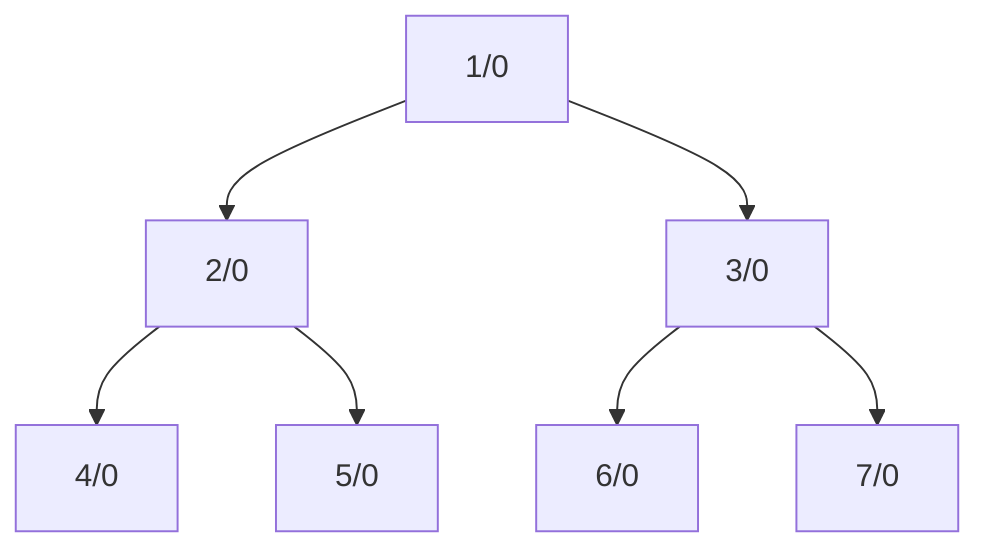

# [Luogu P3218](https://www.luogu.com.cn/problem/P3128)

[TOC]

## **题目大意**：

求取被指定的多条路径覆盖的树中找出被覆盖次数最多的节点

### !!INPUT：

- 第一行
  - `N`: 节点
  - `K`: 路径数

- 接下来`N - 1`行，每一行：
  - `x` `y`: 节点`x`与`y`之间有通路
- 接下来`K`行：
  - `s` `t`: 路径端点

## 思路

考虑使用**链式前向星**建树。

遍历路上的节点，经过一次加`1`。

题中路径已知两端点，记起点为 $u$ , 终点为 $ v $ 则路径为

$$
u \to lca(u, v) \to v
$$

若直接遍历，则时间复杂度为$ O(NK)$ ，按题目数据最多遍历$ 5 \times 10^{10}$ , 这是不能接受的。

考虑使用**树上差分**优化。

> 关于*前缀和 & 差分*的知识，可以去[OI-WiKi](https://oi-wiki.org/basic/prefix-sum)中学习。

> 如果要对结点 $x$ 和 $y$ 之间的路径上的所有点权都加 $v$，可以对它的差分序列 $\{D_x\}$ 做如下操作：
>
> $$
> \begin{aligned}
> D_x &\gets D_x + v, \\
> D_{\operatorname{lca}(x, y)} &\gets D_{\operatorname{lca}(x, y)} - v,\\
> D_y &\gets D_y + v, \\
> D_{\operatorname{fa}(\operatorname{lca}(x, y))} &\gets D_{\operatorname{fa}(\operatorname{lca}(x, y))} - v.
> \end{aligned}
> $$
>
> 在所有修改操作完成后，可以计算一次子树和，就能得到更新后的点权。

### 倍增求LCA

首先第一遍DFS预处理数组，得到二维倍增数组 $fa$ 及 深度数组 `depth`。`fa[u][i]`表示节点`i`往上走$2^i$步的父节点。

接下来进行LCA查询，具体步骤：跳、跳、跳……然后就到LCA了。

从最低节点出发，往上跳`diff`步即可。具体操作：

```cpp
for (int i = 0; i <= LOG; i++)
    if (diff & (1 << i)) // 若 diff 的二进制第 i 位为 1
        u = fa[u][i];
```

再两个点从同一高度出发，~~一起蹦蹦跳跳~~直到两点相同。虽然使用`while`循环可以优化一丢丢，但是这里还是给出`for`循环的代码：

```cpp
for (int i = 0; i <= LOG; i++)
    if (fa[u][i] != fa[v][i])
    {
        u = fa[a][i];
        v = fa[b][i];
    }
```

$lca(u, v)$即为此时的$u = v $的父节点即$fa\_{u,0}$。

### 树上差分

树上差分和一维差分略有不同。树上差分是子节点**"在后续的累加过程中，要向它的父节点（以及自己）传递多少值"**。

例如对于树：



要给路径$2 \to 1 \to 7$加上 $1$ , 只需要给

$$
D_7 \leftarrow D_7 + 1 \\
D_2 \leftarrow D_2 + 1\\
D_1 \leftarrow D_1 - 1\\
$$

如果 $$lca(u,v)$$ 不是根节点，则 $father(lca(u, v))$ 也需要自减。

因为在$D_u$和$D_v$自增的过程中，$lca(u,v)$及其以上的所有节点的值都相应地减了两个$1$，因此给$D_{lca(u,v)}$及其父节点各自减一刚好可以抵消。

在最后结束时，使用前缀和合并差分数组即可得出初始值。

**注意：**需要使用后序遍历（即左->右->根的顺序），因为根节点需要统计**所有**子节点的贡献（直接在递归子节点后加上子节点的值即可）。

**提示：**在后序遍历之前记得先初始化节点值为差分值（因为也包括它自己的贡献）

## 示例代码

```cpp
#include <bits/stdc++.h>
using namespace std;

const int LOG = 20;
const int MAXN = 5e4 + 10;

int fa[MAXN][LOG << 2], depth[MAXN], D[MAXN], val[MAXN];
vector<int> tree[MAXN];

void dfs(int x, int father)
{
    fa[x][0] = father;
    for (int i = 1; i <= LOG; i++)
    {
        fa[x][i] = fa[fa[x][i-1]][i-1]; // 一分为二
    }
    for (auto child: tree[x])
    {
        if (child == fa[x][0]) continue;
        depth[child] = depth[x] + 1; // 深度+1
        dfs(child, x);
    }
}

int lca(int u, int v)
{
    if (depth[v] > depth[u]) swap(u, v);
    int diff = depth[u] - depth[v];
    for (int i = 0; i <= LOG; i++)
        if (diff & (1 << i)) // 若 diff 的第 i 位为 1
            u = fa[u][i];
    if (u == v) return u;
    if (fa[u][0] == fa[v][0]) return fa[u][0];
    for (int i = LOG; i >= 0; i--)
        if (fa[u][i] != fa[v][i])
        {
            u = fa[u][i];
            v = fa[v][i];
        }
    return fa[u][0];
}

void accumulate(int x, int father)
{
    val[x] = D[x];
    for (auto child: tree[x])
    {
        if (child == father) continue;
        accumulate(child, x);
        val[x] += val[child];
    }
}

signed main()
{
    int n, k;
    cin >> n >> k;
    for (int i = 1; i < n; i++)
    {
        int u, v;
        cin >> u >> v;
        tree[u].push_back(v);
        tree[v].push_back(u);
    }

    dfs(1, 0); // 根节点的爸爸是 0

    for (int i = 1; i <= k; i++)
    {
        int s, t;
        cin >> s >> t;

        int l = lca(s, t);

        ++D[s];
        ++D[t];
        --D[l];

        if (fa[l][0])
            --D[fa[l][0]];
    }

    accumulate(1, 0);

    int ans = -0x3f3f3f3f;
    for (int i = 1; i <= n; i++)
    {
        ans = max(ans, val[i]);
    }

    cout << ans << '\n';

    return 0;
}

```
